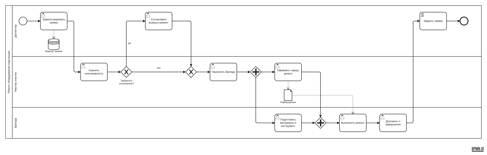

# Архитектор BPMN-диаграмм

ИИ-помощник, который строит BPMN 2.0 диаграмму по текстовому описанию
бизнес-процесса. Хакатон «ИИ-ассистенты для энергетики», первый этап.

## Как это работает

```
описание процесса
   → LLM пишет Python-код на API DIAGRAM
   → песочница выполняет код → граф процесса
   → валидация и автопочинка (ошибки → обратно в LLM, до 2 попыток)
   → автоматическая раскладка (участники — дорожки, слева направо)
   → BPMN 2.0 XML с координатами (DI)
   → открывается и редактируется в bpmn.io
```

LLM отвечает только за смысл: участников, шаги, условия и параллельные ветки.
Валидность XML и читаемую компоновку обеспечивает детерминированный код,
поэтому результат всегда открывается в bpmn.io.

Подробно: [архитектура и план задач](docs/ARCHITECTURE.md).

## Быстрый старт

### Настройка LLM через `.env`

Скопируйте пример окружения:

```bash
cp .env.example .env
```

Проверьте значения:

```dotenv
LLM_BASE_URL=http://localhost:11434/v1
LLM_API_KEY=changeme
LLM_MODEL=qwen2.5-coder:14b
LLM_TEMPERATURE=0.2
LLM_TIMEOUT=60
LLM_MAX_REPAIRS=2
```

- `LLM_BASE_URL` — адрес OpenAI-совместимого провайдера;
- `LLM_API_KEY` — ключ доступа;
- `LLM_MODEL` — модель, которую хотите использовать;
- `LLM_TEMPERATURE` и `LLM_TIMEOUT` — опционально;
- `LLM_MAX_REPAIRS` — число повторов после первой неудачной генерации.

Модель меняется только через `.env`, без правок кода.

### Docker

```bash
docker compose up --build
```

Открыть http://localhost:8000. Переменные из `.env` передаются в контейнер через `docker-compose.yml`, поэтому при запуске LLM будет доступен в веб-API и CLI.

Если Docker Hub недоступен (сборка падает на `FROM python:3.11-slim` с таймаутом),
возьмите тот же официальный образ из зеркала: добавьте в `.env` строку
`BASE_IMAGE=mirror.gcr.io/library/python:3.11-slim` или запустите

```bash
BASE_IMAGE=mirror.gcr.io/library/python:3.11-slim docker compose up --build
```

Если LLM запущена на этом же компьютере (например, Ollama), в `.env` для Docker
укажите `LLM_BASE_URL=http://host.docker.internal:11434/v1`: внутри контейнера
`localhost` — это сам контейнер. Облачным провайдерам это не нужно.

CLI внутри контейнера:

```bash
docker compose exec app python -m bpmn_gen examples/ -o out/ --code
```

Экспорт PNG в образ не входит (браузер для него весит сотни мегабайт), картинки
собираются при локальном запуске.

### Локально

```bash
python3 -m venv .venv && source .venv/bin/activate
pip install -r requirements.txt
cp .env.example .env

uvicorn web.app:app --reload                                           # веб-интерфейс
python -m bpmn_gen examples/01_repair_request/input.txt -o out.bpmn    # CLI с LLM
python -m bpmn_gen --code examples/01_repair_request/code.py -o out.bpmn  # без LLM
python -m bpmn_gen --code examples/01_repair_request/code.py -o out.bpmn --png  # + картинка
pytest                                                                 # тесты
(cd tests/moddle && npm install)                                       # + проверка через bpmn-moddle
```

Пакетный прогон: если передать папку, генератор обработает все описания (`*.txt`,
или `*.py` с флагом `--code`) и сохранит в `out/` схемы и отчёт `report.md` / `report.json`:
сколько схем построено и сколько валидны по XSD, наложения фигур, стрелки сквозь фигуры,
пересечения стрелок, предупреждения валидатора, число попыток генерации и время.

```bash
python -m bpmn_gen examples/ -o out/            # по текстам, нужна LLM
python -m bpmn_gen examples/ -o out/ --code     # по готовому коду
```

Сравнение моделей на одном наборе: модели перечисляются через запятую, для каждой
сохраняется свой отчёт, а в `out/models.md` — сводная таблица (сколько схем построено
и валидно, сколько попыток понадобилось, сколько логических ошибок модель не исправила,
пересечения стрелок, время). Так проверяется, что основной сценарий сохраняется при
замене модели.

```bash
python -m bpmn_gen bench/ -o out/ --model gpt-oss:120b,gpt-oss:20b,nemotron-3-nano:30b -j 4
```

`-j 4` отправляет до четырёх процессов в модель одновременно, это в несколько раз быстрее.
Если провайдер ограничивает число одновременных запросов (ошибка 429), уменьшите число.

`bench/` — проверочный набор из 8 процессов с эталонными схемами, см. [bench/](bench/README.md).

Если рядом с описанием лежит эталон (`code.py`), отчёт сравнивает с ним схему модели:
какая доля участников и шагов эталона найдена, сохранён ли порядок найденных шагов
и какая доля шагов модели есть в эталоне (точность). Названия сопоставляются нечётко,
с учётом частых синонимов: «Регистрация заявки» засчитывается за «Зарегистрировать заявку»,
«Отправить» — за «Направить». Пропущенное из эталона перечисляется в отчёте.
Эталон — один из возможных способов нарисовать процесс, поэтому метрика показывает
совпадение с ним, а не правильность как таковую: её удобно использовать, чтобы сравнивать
модели и версии промпта между собой. Уже готовые результаты можно сравнить без повторного запуска модели:

```bash
python -m bpmn_gen.compare out/gpt-oss_20b/ bench/
```

Для `--png` нужен playwright: `pip install playwright && python -m playwright install chromium`.

Файл `out.bpmn` открывается на [demo.bpmn.io](https://demo.bpmn.io)
(перетащить файл в окно) или в Camunda Modeler.

## API для генерации кода

Модель пишет код на API из ТЗ; перед выполнением заданы `ROOT_PROCESS_ID`,
`ROOT_START_TASK_ID`, `ROOT_END_TASK_ID`.

| Метод | Что создаёт |
| --- | --- |
| `add_task / add_user_task / add_script_task(name, parent)` | задачу |
| `add_exclusive / parallel / inclusive_gateway(name, parent)` | шлюз |
| `add_pool(parent, [lanes])` → `(pool_id, lane_ids)` | пул с дорожками |
| `create_subprocess(name, parent)` | развёрнутый подпроцесс |
| `add_group(name, parent)` | группу (рамку) |
| `add_link(source, target, name='')` | связь; `name` — подпись ветки (наше расширение) |
| `set_name(name)` | название процесса (наше расширение) |
| `add_data_object(name, parent)` | документ (наше расширение) |
| `add_data_store(name, parent)` | хранилище данных или ИТ-систему (наше расширение) |

Связь задачи с документом или хранилищем задаётся тем же `add_link`:
`add_link(task, doc)` — задача создаёт документ, `add_link(doc, task)` — задача его использует.

Валидатор помечает обрывы логики: шаги, из которых процесс никуда не идёт,
развилки без подписей или с одной веткой, документы, которые создаются и не
используются. Ошибки, которые ломают процесс, возвращаются модели на исправление:

- альтернативные или включающие ветки сходятся в параллельном шлюзе — процесс зависнет;
- параллельные или включающие ветки сходятся в исключающем — шаг выполнится несколько раз;
- цикл без выхода — из шагов нельзя дойти до завершения;
- шаги, в которые нельзя попасть от старта, и шаги, в которые ничего не ведёт;
- развилка с одной веткой — второй исход условия потерялся;
- сообщение между пулами идёт из шлюза или в шлюз.

Если у пула есть отправка сообщения и приём ответа, они соединяются: процесс ждёт ответа,
а не заканчивается и начинается заново.

## Структура

```
bpmn_gen/
  graph.py      ProcessGraph — общая модель процесса (контракт)
  diagram.py    фреймворк DIAGRAM
  validate.py   проверки и автопочинка
  layout.py     автоматическая раскладка
  render.py     BPMN 2.0 XML + DI
  quality.py    проверка по XSD и метрики читаемости
  batch.py      пакетный прогон по папке с отчётом
  xsd/          официальная XSD BPMN 2.0 от OMG
  sandbox.py    безопасное выполнение кода модели
  llm.py        запросы к модели, промпты в prompts/
  pipeline.py   сквозной конвейер
  cli.py        командная строка
web/            FastAPI + интерфейс на bpmn-js
examples/       входные описания и полученные схемы
bench/          проверочный набор: 8 процессов с эталонными схемами
tests/          тесты
docs/           архитектура и план задач
```

## Примеры

В каждой папке `examples/` лежат описание процесса (`input.txt`), код на API
DIAGRAM (`code.py`), схема (`output.bpmn`) и картинка (`output.png`).
Подробнее: [examples/](examples/README.md).

| Пример | Участники | Что показывает |
| --- | --- | --- |
| [Ремонт оборудования подстанции](examples/01_repair_request/) | диспетчер, мастер участка, бригада | условие, параллельные ветки, документ и журнал |



## Возможности и ограничения

**Что умеет:**

- участники как дорожки в одном пуле или отдельные пулы; связи между пулами
  становятся потоками сообщений;
- задачи (обычные, пользовательские, системные), исключающие, параллельные и
  включающие шлюзы с подписанными ветками, развёрнутые подпроцессы, группы;
- документы и хранилища данных, связанные с задачами;
- самопочинка: ошибки выполнения кода, структуры и логики шлюзов возвращаются
  в LLM, до `LLM_MAX_REPAIRS` повторов;
- автопочинка мелочей без LLM: висячие шаги, лишние шлюзы, элементы вне дорожек;
- раскладка без наложений фигур и стрелок сквозь фигуры: участники — дорожки,
  процесс идёт слева направо, возвраты — обратными стрелками сверху или снизу,
  смотря где меньше пересечений; документ или система, нужные далеко по ходу
  процесса, показываются второй раз рядом с задачей (в XML это один объект);
- результат проходит официальную XSD BPMN 2.0 и открывается в bpmn.io и
  Camunda Modeler; в веб-интерфейсе схему можно править и скачать как `.bpmn` или `.svg`;
- любой OpenAI-совместимый провайдер: локальная Ollama, Ollama Cloud и другие —
  меняется в `.env`;
- пакетный прогон с отчётом о качестве.

**Ограничения:**

- из событий есть только начало и конец: промежуточных событий, таймеров и
  граничных событий нет; подпроцессы только развёрнутые;
- смысловые ошибки модели валидатор не всегда видит: например, общий шаг,
  который модель поставила только в одну ветку развилки;
- на сложных схемах с несколькими развилками и возвратами пересечения стрелок остаются
  (на проверочном наборе — 19 на 8 схем, около двух на схему);
- качество схемы зависит от модели; проверено на `gpt-oss:120b`;
- PNG собирается только при локальном запуске с playwright.

## Команда

| Участник | Роль |
| --- | --- |
| Никита Коробков | ядро BPMN: модель процесса, API DIAGRAM, валидатор, раскладка, BPMN XML, веб-интерфейс, Docker |
| Дима Гордиенко | ИИ: подключение LLM, промпты и примеры, песочница, цикл самопочинки |
