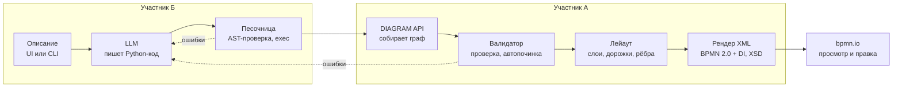

# Архитектор BPMN — архитектура и план задач

Живая версия документа: [claude.ai](https://claude.ai/code/artifact/61e5604d-0432-4471-86d3-3b24231b30ae)

## Цель и требования

На первом этапе нужен рабочий прототип: текстовое описание процесса → LLM пишет Python-код на нашем API `DIAGRAM` → код строит BPMN 2.0, который открывается и редактируется в bpmn.io. Использовать LLM-генерацию кода обязательно, так прямо сказано в ТЗ.

**Прототип должен:**

- принимать описание бизнес-процесса;
- показывать участников (пулы/дорожки), последовательность действий и ветвления;
- выдавать файл BPMN 2.0, соответствующий XML-схеме стандарта;
- открываться и редактироваться в bpmn.io (значит, обязателен раздел DI с координатами).

**Сдаём:** прототип, исходный код с инструкцией запуска, примеры входов и результатов, краткое описание возможностей и ограничений. На демо обязателен пример с несколькими участниками и ветвлением.

| Критерий | Баллы | Чем закрываем |
| --- | --- | --- |
| Репрезентативность материалов | 0–10 | 6–8 примеров из энергетики: текст → код → .bpmn → PNG; README; короткое видео/GIF |
| Качество и новизна реализации | 0–10 | цикл самопочинки, безопасная песочница, свой лейаут с дорожками, XSD-валидация, итеративная доработка схемы |
| Бизнес-ориентированность | 0–10 | процессы отрасли, экономия времени аналитика, результат в привычном bpmn.io |

## Архитектура

LLM отвечает только за смысл: участников, шаги и связи. Структуру, координаты и валидность XML обеспечивает наш код, поэтому результат всегда открывается в bpmn.io.



Если код модели падает в песочнице или граф не проходит валидацию и не чинится автоматически, текст ошибки уходит обратно в LLM (до 2 раз).

**Главный контракт** — модель графа `ProcessGraph` (узлы, связи, контейнеры) в `bpmn_gen/graph.py`. Её фиксируем в первый день: А строит по ней лейаут и XML, Б пишет промпты под тот же API, и дальше мы работаем независимо.

## Компоненты и контракты

| Компонент | Вход → выход | Ключевые решения | Кто |
| --- | --- | --- | --- |
| `graph` — модель процесса | — → `ProcessGraph` | узлы (тип, имя, родитель-контейнер), связи (от, куда, подпись), контейнеры (процесс, пул, дорожка, подпроцесс, группа); dataclasses | А |
| `diagram` — фреймворк DIAGRAM | вызовы API → `ProcessGraph` | все методы из примера ТЗ + необязательный `add_link(a, b, name=...)` для подписей веток; понятные ошибки при неверных id | А |
| `validate` — валидатор | граф → граф + список проблем | автопочинка: висячие узлы → к старту/концу, шлюз с 1 выходом → убрать, связь между пулами → message flow, старт/конец → в нужную дорожку; нечинимое — в LLM | А |
| `layout` — раскладка | граф → координаты фигур и точки рёбер | слои слева направо (Sugiyama), дорожки — горизонтальные полосы, циклы — обратные рёбра, ортогональные линии, размер подпроцессов снизу вверх | А |
| `render` — BPMN XML | граф + координаты → `.bpmn` | lxml, collaboration/participant/laneSet, BPMNDI; проверка по официальной XSD в тестах | А |
| `llm` — генерация кода | текст (+ ошибки) → Python-код | системный промпт с описанием API, few-shot из энергетики, провайдер через `.env` (OpenAI-совместимый), цикл починки до 2 раз | Б |
| `sandbox` — исполнение | код → граф или traceback | AST-whitelist (присваивания, литералы, вызовы `DIAGRAM.*`), без import и `__`, урезанные builtins, таймаут; заранее заданы `ROOT_*` | Б |
| `api` + UI | HTTP → XML, код, предупреждения | FastAPI `POST /api/generate`; страница: текст → сгенерированный код → редактор bpmn-js, кнопка «скачать .bpmn» | Б |
| `cli` | файл .txt → .bpmn + .py | `python -m bpmn_gen in.txt -o out.bpmn`, режим `--code` (без LLM, из готового кода) | Б |

Режим `--code` важен: А может тестировать лейаут и XML на рукописных скриптах, не дожидаясь LLM.

## Стек и структура репозитория

Стек: Python 3.11, FastAPI, lxml, SDK `openai` (любой OpenAI-совместимый провайдер), bpmn-js локальным бандлом, pytest, Docker Compose. Запуск для жюри — одна команда `docker compose up`.

```
bpmn_gen/
  graph.py        ProcessGraph — общий контракт          (А)
  diagram.py      фреймворк DIAGRAM                      (А)
  validate.py     проверки и автопочинка                 (А)
  layout.py       раскладка                              (А)
  render.py       BPMN 2.0 XML + DI                      (А)
  sandbox.py      безопасное исполнение кода             (Б)
  llm.py          клиент, промпты, цикл починки          (Б)
  pipeline.py     текст → .bpmn, склеивает всё           (Б)
  prompts/        system.md, few-shot примеры            (Б)
  cli.py                                                 (Б)
web/              FastAPI + страница с bpmn-js           (Б)
examples/         вход .txt → .py → .bpmn → .png         (А+Б)
tests/            юниты + XSD-валидация всех примеров
  xsd/            официальные BPMN20.xsd от OMG
docs/             этот документ
```

Работа с git: у каждого свои ветки `feature/<что-то>`, мёрдж в `main` через MR (пуш прямо в `main` закрыт), авторизация — HTTPS + личный PAT. Затрагивать файлы друг друга почти не придётся: общие только `graph.py` и `examples/`.

## Распределение задач

Работа делится по границе `ProcessGraph`: **А — ядро BPMN** (всё, что после графа), **Б — ИИ и продукт** (всё, что до него, плюс упаковка). P0 — без этого нет демо, P1 — качество и баллы, P2 — если останется время.

### Участник А — ядро BPMN

- [ ] P0 · `graph.py`: модель узлов, связей и контейнеров (согласовать с Б в первый день)
- [ ] P0 · `diagram.py`: методы `add_task`, `add_user_task`, `add_script_task`, `add_link`, три шлюза, `add_pool`; старт/конец корня
- [ ] P0 · `render.py`: process, sequenceFlow, laneSet, collaboration/participant + BPMNDI
- [ ] P0 · `layout.py` v1: слои слева направо + дорожки, прямые рёбра
- [ ] P0 · тест: каждый `.bpmn` проходит XSD и открывается в bpmn.io
- [ ] P1 · `validate.py`: автопочинка + список проблем для LLM
- [ ] P1 · `layout.py` v2: минимизация пересечений, ортогональные рёбра, циклы, выравнивание split/merge
- [ ] P1 · связи между пулами → message flow
- [ ] P2 · `create_subprocess` (развёрнутый, со своими стартом/концом) и `add_group`
- [ ] P2 · экспорт PNG/SVG для примеров

### Участник Б — ИИ и продукт

- [ ] P0 · выбрать LLM и получить доступ; `llm.py` с провайдером через `.env`
- [ ] P0 · системный промпт: описание API, правила (один участник = одна дорожка, условие = XOR, «одновременно» = AND), 2–3 few-shot
- [ ] P0 · `sandbox.py`: AST-whitelist, таймаут, понятный traceback
- [ ] P0 · `pipeline.py` + `cli.py`: текст → код → граф → `.bpmn` (пока нет ядра А — на заглушке)
- [ ] P0 · набор из 6–8 описаний процессов энергетики (техприсоединение, заявка на ремонт, наряд-допуск, ликвидация аварии, согласование отключения)
- [ ] P1 · цикл самопочинки: ошибки песочницы и валидатора → повторный запрос, до 2 раз
- [ ] P1 · `web/`: FastAPI + страница (текст → код → bpmn-js → скачать)
- [ ] P1 · Docker, `.env.example`, README (запуск, возможности, ограничения)
- [ ] P1 · метрика: доля верно распознанных участников, шагов и связей на наборе примеров
- [ ] P2 · итеративная доработка: «добавь согласование с юристом» дописывает текущий код

### Вместе

- [ ] P0 · зафиксировать `ProcessGraph` и семантику `add_pool` / `add_group` / `create_subprocess`
- [ ] P1 · прогнать все примеры, собрать `examples/` (текст, код, .bpmn, PNG)
- [ ] P1 · питч и сценарий демо: пример с 3+ участниками, ветвлением и параллелью

## План и точки синхронизации

Первым делом собираем сквозной прогон «текст → открывающийся .bpmn», пусть и некрасивый, и только потом улучшаем качество. Даты привяжем, когда будет известен дедлайн этапа.

| Этап | Участник А | Участник Б | Точка | Критерий прохождения |
| --- | --- | --- | --- | --- |
| 1 · Контракт | `graph.py`, каркас репо | доступ к LLM, черновик промпта | G1 | `graph.py` в `main`, семантика пулов, групп и подпроцессов согласована, у Б есть рабочий ключ LLM |
| 2 · Сквозной MVP | diagram + render, layout v1 | sandbox, pipeline, CLI, 3 примера | G2 | CLI превращает пример с 2 участниками и XOR-ветвлением в .bpmn, который открывается в bpmn.io |
| 3 · Качество | validate, layout v2, message flow | самопочинка, UI, метрика качества | G3 | все примеры проходят XSD, схемы без пересечений фигур, UI работает |
| 4 · Упаковка | PNG примеров, подпроцессы (P2) | Docker, README, примеры, питч | Сдача | `docker compose up` с чистого клона работает, README и `examples/` в `main` |

Синхронизация: короткий созвон на каждой точке G, между ними — MR с ревью друг друга.

## Открытые вопросы и риски

- [ ] Какую LLM берём и есть ли ограничения организаторов (отечественная, локальная, внешние API)?
- [ ] Когда дедлайн первого этапа и как выглядит демо (видео, живой показ)?
- [ ] Кто из нас А, а кто Б?

| Риск | Что делаем |
| --- | --- |
| LLM пишет нерабочий или неполный код | строгий промпт + few-shot, цикл самопочинки, автопочинка графа |
| Лейаут с дорожками съедает всё время | v1 простой и рабочий к G2, улучшения только после него |
| bpmn.io не открывает файл, хотя XSD пройдена | проверять каждый пример в demo.bpmn.io, добавить тест через bpmn-moddle, если будет время |
| Семантика `add_group` / `create_subprocess` в ТЗ размыта | фиксируем свою трактовку на G1 и описываем в README |
| Нет доступа к LLM на показе | заранее сгенерированные примеры + режим `--code` без LLM |
